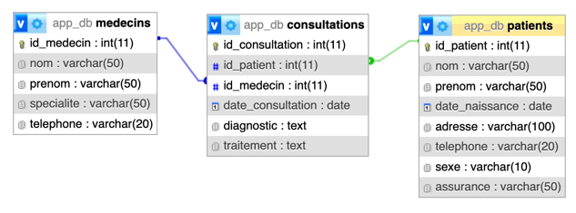

# TD 6 - Les views SQL
[]()

## Description
Projet contenant une base de données MariaDb et un PHPMyAdmin ayant pour finalité
de s'initier et s'entrainer à la création de views en SQL.

### Schéma de la base de données


## Installation
- `docker compose up -d` pour démarrer les services

## Documentation

### Définition
Une **view** (ou vue en français) est une table virtuelle qui est le résultat d'une requête SQL. 
Elle ne stocke pas directement les données, mais contient une définition de requête pour extraire les données d'une 
ou plusieurs tables de la base de données. Les views sont utilisées pour simplifier les requêtes et pour sécuriser 
l'accès aux données sensibles.

### Prinicpaux avantages
- **Simplicité des requêtes** : Les views permettent de simplifier des requêtes complexes en une seule.
- **Sécurité** : Elles restreignent l'accès aux données sensibles, en affichant uniquement les colonnes autorisées.
- **Indépendance des données** : En cas de changement dans les tables sources, la view peut rester intacte, permettant une plus grande flexibilité.
- **Réutilisation** : Une view peut être réutilisée dans d'autres requêtes sans avoir à réécrire la logique.

### Création d'une View

```sql
    CREATE VIEW nom_de_la_view AS
    SELECT colonnes
    FROM tables
    WHERE condition;
```
**Exemple** : Créons une view qui montre uniquement les informations essentielles des employés.
```sql
    CREATE VIEW employes_ville AS
    SELECT nom, prenom, ville
    FROM employes
    WHERE ville = 'Paris';
```
Ici, la view `employes_ville` affiche uniquement les noms, prénoms et la ville des employés de Paris.

### Consultation des données d'une View

Une fois la view créée, elle peut être utilisée comme une table classique avec la commande `SELECT`.
```sql
    SELECT * FROM employes_ville;
```

### Mise à jour d'une View
Pour modifier une view, il faut utiliser la commande `CREATE OR REPLACE VIEW`, ce qui permet de redéfinir la requête de la view sans la supprimer.

```sql
    CREATE OR REPLACE VIEW employes_ville AS
    SELECT nom, prenom, ville, departement
    FROM employes
    WHERE ville = 'Paris';
```

### Suppression d'une View
Pour supprimer une view, il suffit d'utiliser la commande `DROP VIEW`.
```sql
    DROP VIEW employes_ville;
```